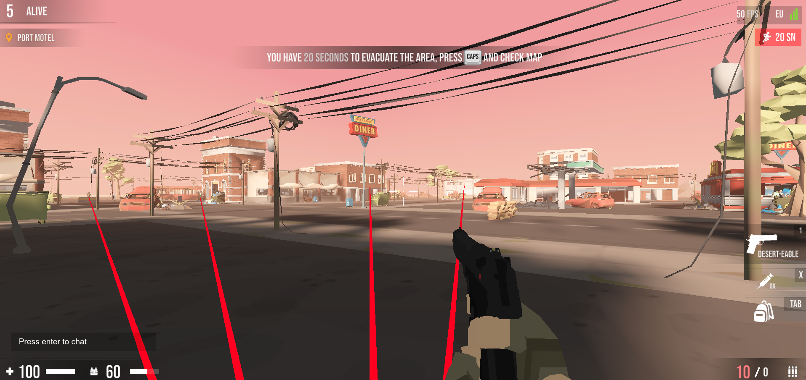

# Miniroyale cheats.

Open the [game](https://miniroyale2.io/). In the lobby, open the developer tools and paste code from the links below.

## Lines.
Renders [red lines](cheats/lines.js) to each enemy on the map.

## Damage.
Increases [damage](cheats/damage.js) per shot.
